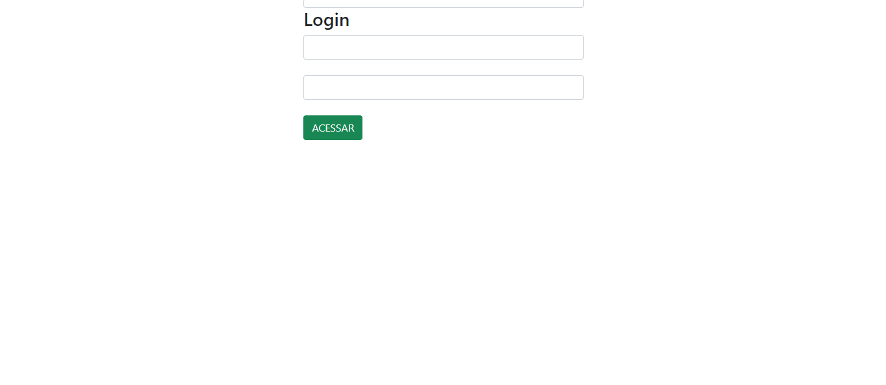
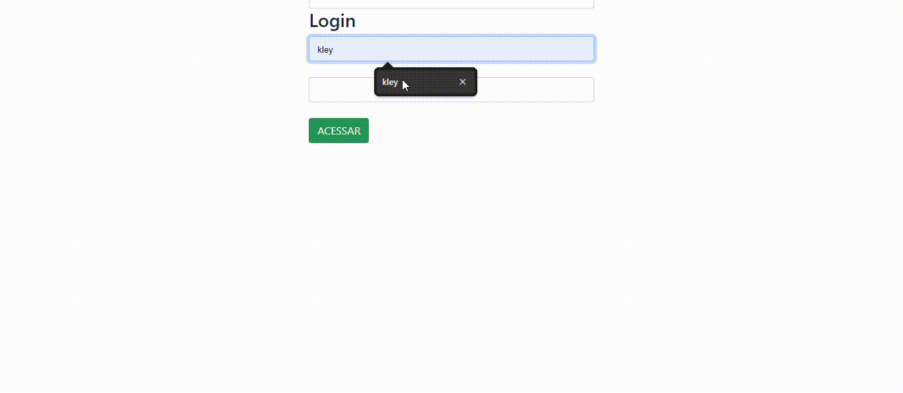
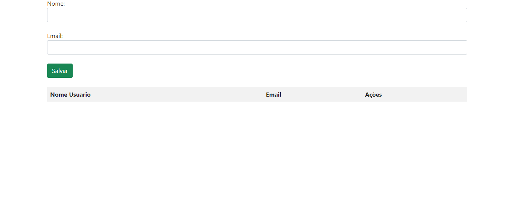
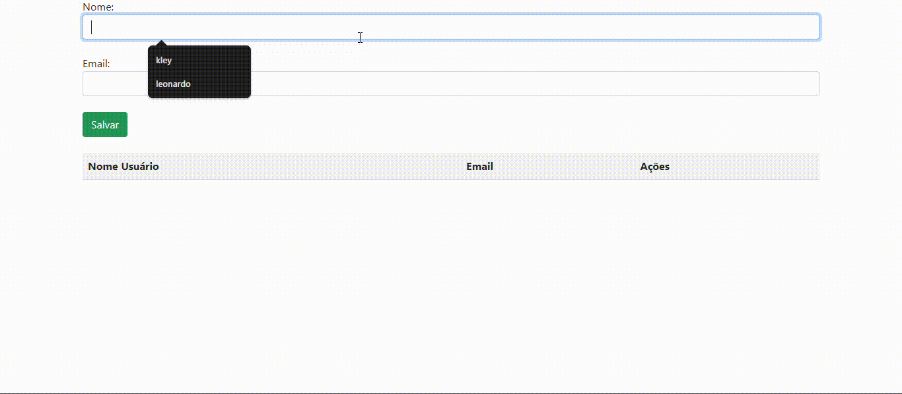

# Tela de Login
Essa é uma tela de login com campos para nome e senha, aonde é necessário preenche-la corretamente para que você prossiga para a tela de cadastro do projeto.

# Tela de cadastro
Essa é uma tela de cadastro feito de forma experimental para que seja estudado e treinado a função de JavaScript e Array para criação de lista. No site é possível que você digite um nome, aonde depois é possível clicar no botão de "Acessar" o que fará com que o nome digitado apareça na lista abaixo, além de um campo para E-mail que só será possível enviar o nome e E-mail caso ambos estejam preenchidos de forma correta.

## Descrição 
O site possui um Css simples, não tendo muitos enfeites, mas fazendo jus ao seu propósito. Como citado antes, à uma barra aonde é possível digitar seu nome e email e um botão aonde é possível clicar para que você envie o necessario que foi digitado para uma lista, ambos ficam aparente nessa lista, e surge também 2 botões, um escrito "Excluir" e o outro "Editar". Caso clique no botão excluir, o nome digitado irá desaparecer da lista, sendo assim excluido, caso clique no botão editar, o nome digitado irá voltar para a a barra aonde se digita o nome, e a partir dali é possível que você edite o nome digitado e depois o retorne para a lista.

## Função
O site apenas tem a função de fazer uma simulação de uma tela de cadastro simples, contendo Javascript, html e css, sendo seu real objetivo treino para apreender mais sobre o Javascript e sobre Array.

## Linguagem utilizadas
- DadosLista: é uma variável usado para armazenar os nomes digitados para que fiquem armazenados no array;

- nomeUser: uma variável que é responsável por armazenar os noomes digitados;

- tabela: é uma variável responsável pelo local aonde fica armazenado os nomes digitados;

- i: tem a função de complementar o array para que de continuidade a sua função;

- acessar: tem a função de adicionar o nome digitado a lista;

- salvarUser: tem a função de adicionar um novo nome a lista;

- criarLista: deixa aparente os nomes digitados da lista;

- excluir: tem a função de apagar um nome já digitado na lista;

- editar: tem a função de editar um nome que já está presente na lista;

- loginEmail: tem a função de adicionar ao projeto uma sessão de Email;

## Tecnologias utilizadas 

* ``HTML 5``
* ``CSS 3``
* ``Java Script``
* ``Github``
* ``VsCode``
* ``Microsoft Teams``

## Autor
Kleyverson de Oliveira Sampaio